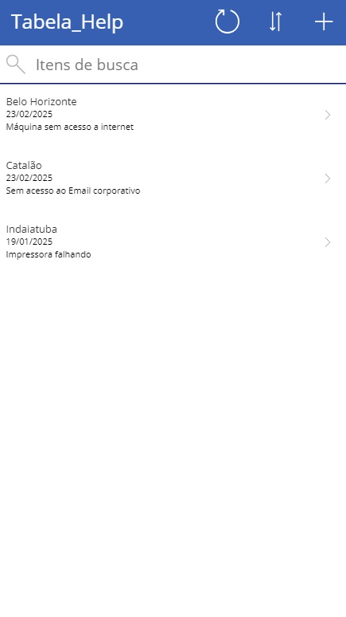
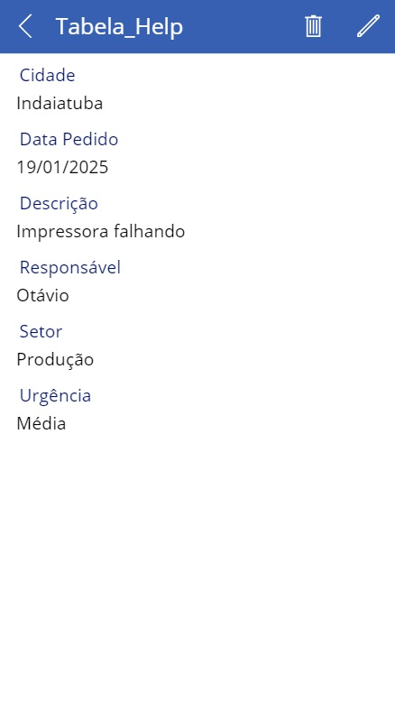
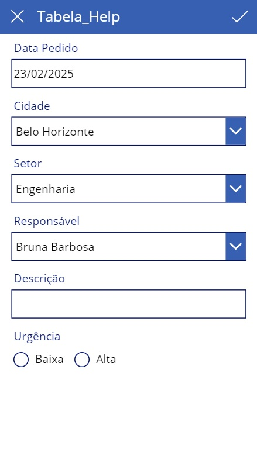

# Link for my helpDesk powerApp
[make.powerApps.com](https://apps.powerapps.com/play/e/default-cf72e2bd-7a2b-4783-bdeb-39d57b07f76f/a/70d61965-b7e4-42b0-94b8-b60795e6057a?tenantId=cf72e2bd-7a2b-4783-bdeb-39d57b07f76f&hint=96a4f1af-9fbb-4e02-bc47-fc98fd4618a7&sourcetime=1740334816016)

# Explanation
## 1. On the first screen we'll have an overall of all current help calls 
 
Notice that you can order by alphabetic and reload, but since you click on any of the calls you can have a detailed description, leading to the second page. 
## 2. There are the descriptions displayed for your better understanding 
 
Besides having a full view of the problem, two buttons, one for edit and the other to remove complements de window if the user needs to to any of these actions 
## 3. Finally, in the last screen, which is the main focus of the app, the user can fill the inputs to explain the problem he is asking for a solution, so the Help service can get tunned in about the problem. 

